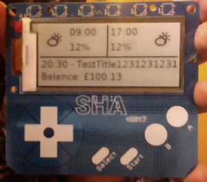

# sha2017-badge-display

## About

Gets information from my API and displays it.

This is very hacky. Runs on the sha2017 badge.

The icons for the weather included are some modified [Skycons](https://darkskyapp.github.io/skycons/).

All the data is aggregated using [my aggregator](https://github.com/NiallBunting/rest-api-aggregator).

## How it looks

This is it with some example data:

## Future Plans

I hope to have a few pages of information in the future that can be flicked through.
